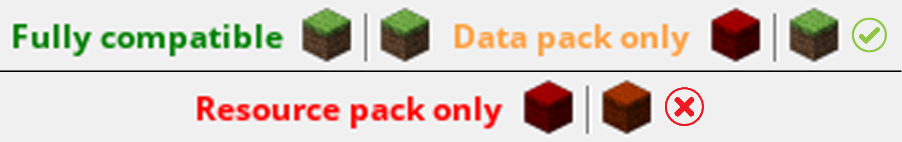
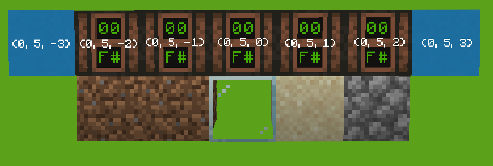
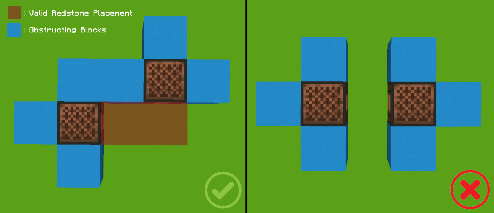
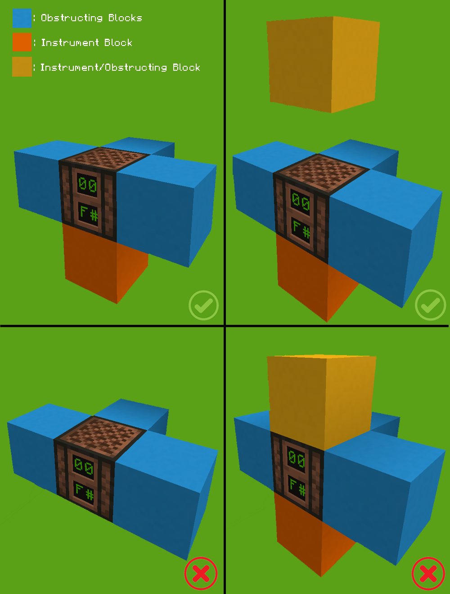

# WirelessNBS
Turns a .nbs file into a Wireless Noteblock Piece via datapack.

## Prerequisites
This program requires >= [Python](https://www.python.org/downloads/) 3.6, [pip](https://pip.pypa.io/en/stable/installing/), [Git](https://git-scm.com/downloads), [PyNBS](https://github.com/vberlier/pynbs), [Open Note Block Studio](https://opennbs.org/), and [Minecraft](https://www.minecraft.net/).

PyNBS can be installed with `pip`:
 ```
 $ pip3 install pynbs
 ```
 
 NBS files can be made using Open Note Block Studio, and the datapack can be run using Minecraft.
 
## Installation
To install this program, simply do this:
 ```
 $ git clone https://github.com/miclol/WirelessNBS
 ```
 
## NBS Validity
When making a NBS file, make sure the notes are within the Minecraft limit and you're not using any custom instruments.
Use the image below to validate whether the program can support the .nbs file.

 

## JSON Configuration
Before you use this program you must create a file with the same name as the `.nbs` file but instead of `.nbs`, the filetype needs be `.json`, and put it in the `WirelessNBS` directory. (If `.nbs` file is `Example.nbs` , then create  `Example.json`). 

 The formatting of the JSON file will be as follows:
```json
 {
  "instruments": {
    "(instrument 1)": [["(coords. 1)"], ["(coords. 2)"]],
    "(instrument 2)": [["(coords. 1)"]]
  },
  "obstructions": [["(coords. 1)"], ["(coords. 2)"]]
 }
```
 The list of valid instruments are as follows (note that it is case-sensitive) with it's instrument block:

|Valid Instrument|Instrument Block|
|--|--|
|`piano`|Any Other Block not mentioned|
|`double bass`|Wood-Based Blocks|
|`bass drum`|Stone-Based Blocks|
|`snare drum`|Sand, Gravel, Concrete Powder|
|`click`|Glass, Sea Lantern, Beacon|
|`guitar`|Wool|
|`flute`|Clay|
|`bell`|Block of Gold|
|`chime`|Packed Ice|
|`xylophone`|Bone Block|
|`iron xylophone`|Block of Iron|
|`cow bell`|Soul Sand|
|`didgeridoo`|Pumpkin|
|`bit`|Block of Emerald|
|`banjo`|Hay Bale|
|`pling`|Glowstone|

You can also configure obstructing blocks, using `obstructions`, where you don't want the redstone placement to overwrite that certain block.

Let's say that the note blocks you placed down are configured like this:



There are 2 "Piano"s, 1 "Click", 1 "Snare Drum", 1 "Bass Drum", and 2 Obstructing Blocks.
In this scenario, `Example.json` will look like this:
```json
{
  "instruments": {
	"piano": [[0, 5, -2], [0, 5, -1]],
	"click": [[0, 5, 0]],
	"snare drum": [[0, 5, 1]],
	"bass drum": [[0, 5, 2]]
  },
  "obstructions": [[0, 5, -3], [0, 5, 3]]
}
```

You are allowed to configure the note block coordinates and the obstructing blocks however you want, but you need to keep some rules in mind:
- At least 1 side of each note block's face must be kept clear so the note block can be activated; but that same face must not be used by another note block.



- Leave a 2 block gap above and a 1 block gap below a noteblock, so the instrument block can be placed below it and an air gap above it. Above that, an instrument block could be placed if necessary.



## Usage
1. Go into the `WirelessNBS` directory.
2. Copy the NBS file into the same directory as the program.
3. Make sure you have your corresponding `.json` file in the same directory as the program.
4. Open console and run the program by doing:
 ```
 $ python3 nbsToWireless.py
 ```
5. You'll be prompted to input the .nbs file that you're trying to convert. Input that and press 'Enter'.
6. You'll be prompted to input the name of the datapack. Input that and press 'Enter'.
7. After it finishes, move the .zip folder to the datapack folder in the world you're using it in.
